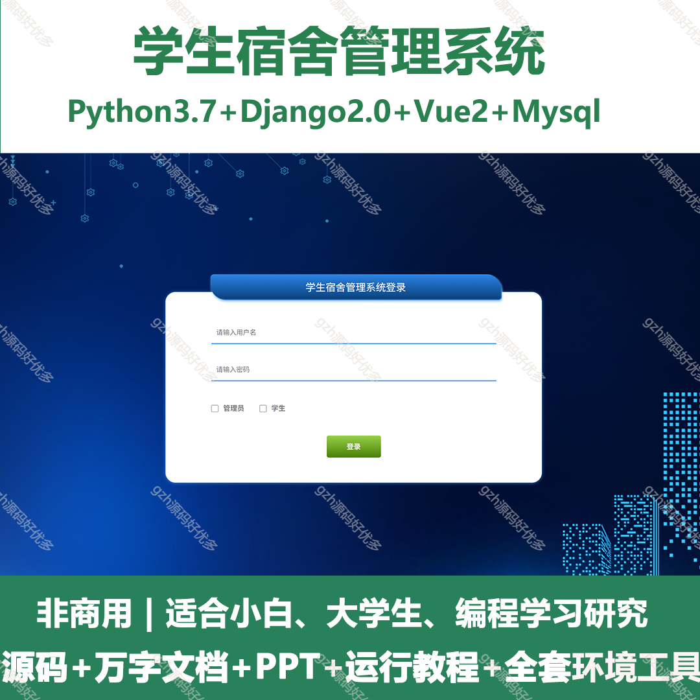
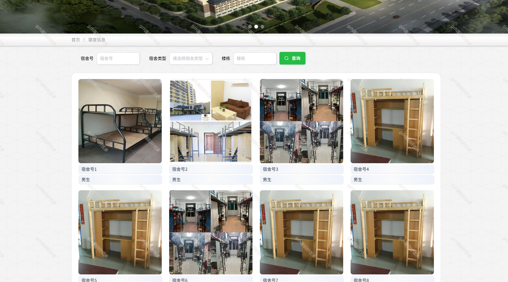
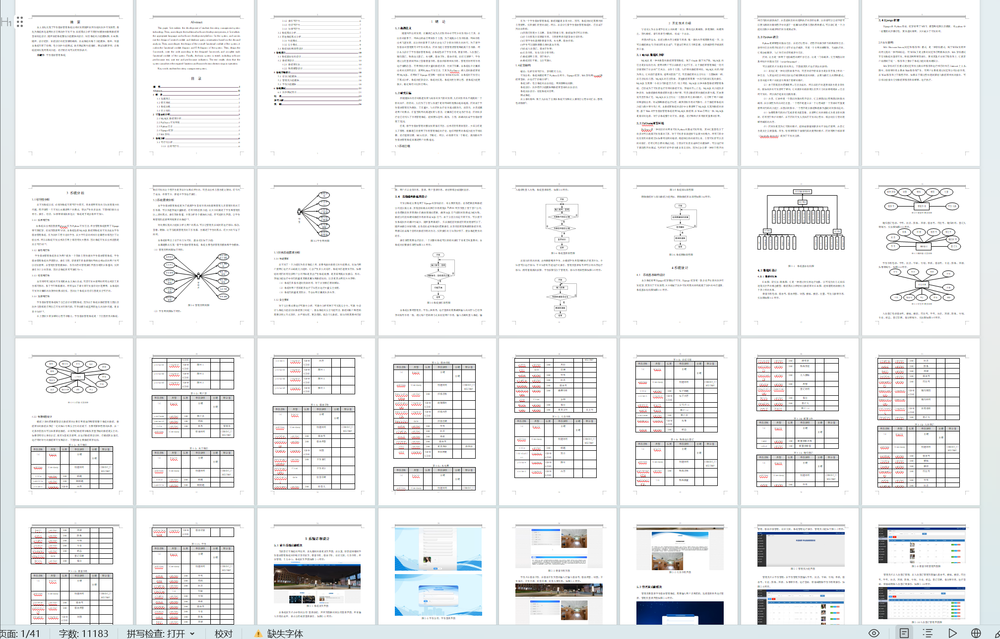
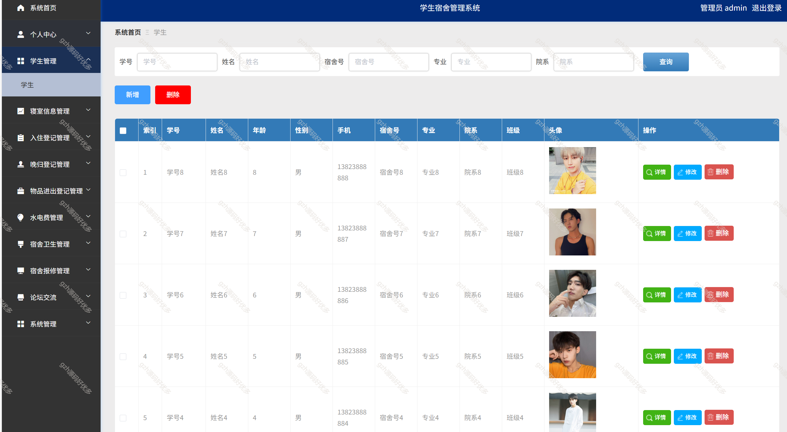
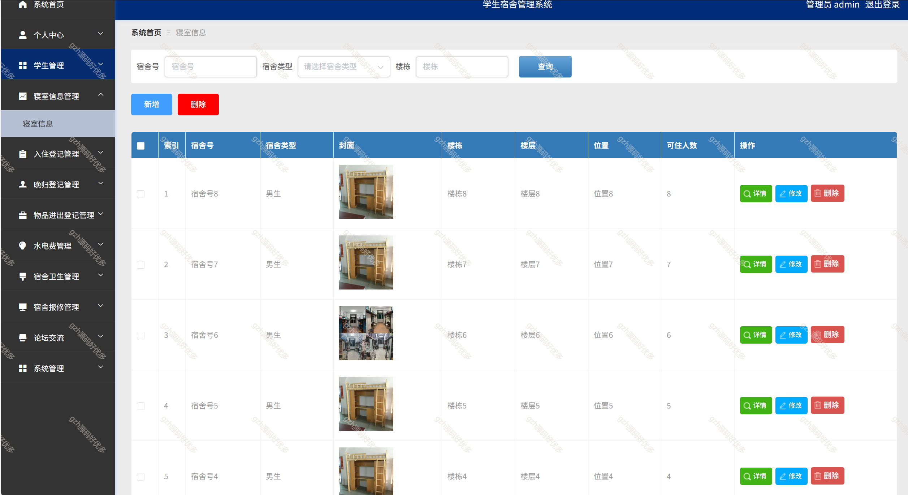
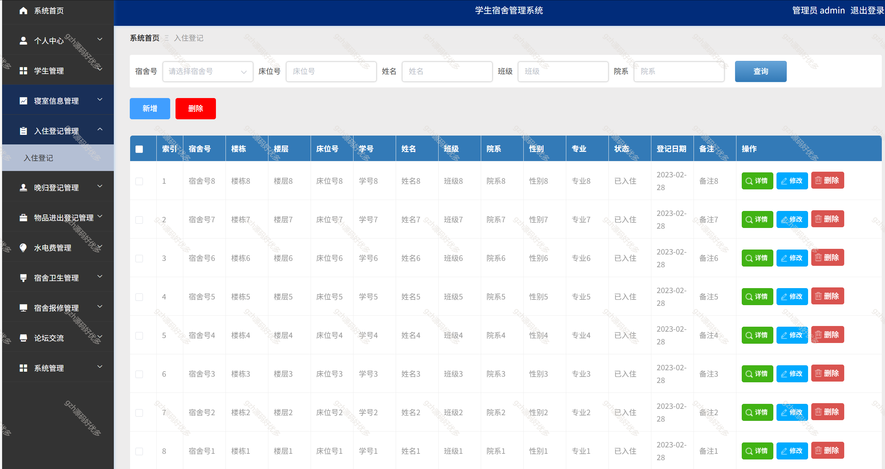
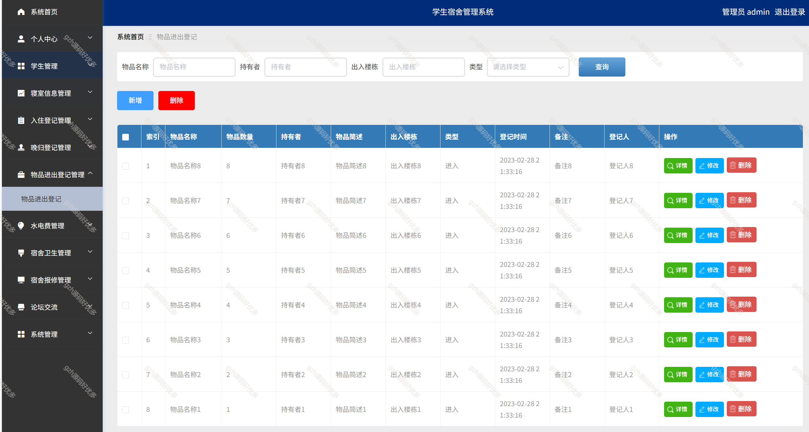

# python046
python046基于Python+Django的学生宿舍管理系统
 
## 查看主页获取源码

### 一、关键词
宿舍系统，学生宿舍系统

### 二、作品包含
源码+数据库+万字文档PPT+全套环境和工具资源+部署教程

### 三、项目技术
前端技术：Vue2.0、Element-ui
后端技术：Python3.7、Django2.0

### 四、运行环境（以下版本亲测，其他版本未知，请自测）
开发工具：PyCharm + VSCODE

数据库：MySQL5.7（最低要5.7版本）

数据库管理工具：Navicat10+

Python：Python3.7

前端Nodejs：14

浏览器：谷歌浏览器

### 五、项目介绍
项目编号：python046

伴随着国内经济的高速发展与城市的快节奏的发展，人们的生活水平提高到一个新的水平，渐渐的，人们为了方便与快捷于是对网络环境要求越来越高。同时由于学生宿舍管理较为复杂，工作量大，与此同时本行业也追求高效化、规范化，并且能满足用户的要求。正值互联网的高速发展与普及，计算机已经走进各行各业，同时许多行业已经引入了信息管理系统，能够更加透明、高效、方便、准确的完成学生宿舍管理工作。

该系统包括了学生信息、寝室信息、入住登记、晚归登记、物品进出登记、水电费、宿舍卫生、宿舍报修、论坛交流等。学生通过注册登录到网站上查看寝室信息、宿舍报修等相关信息，管理员对所有信息进行增删改查。

### 六、运行截图

